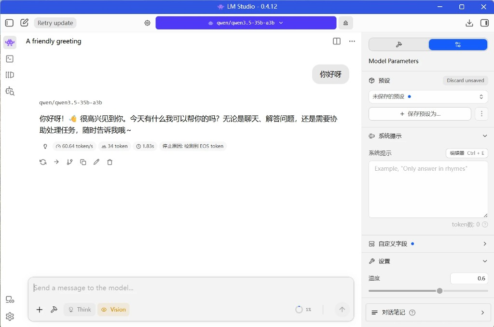

<!--
Copyright Advanced Micro Devices, Inc.

SPDX-License-Identifier: MIT
-->

<!-- @github-only -->
> [!IMPORTANT]
> 此 playbook 使用了 GitHub 无法直接渲染的特殊标记。请访问 [amd.com/playbooks](https://amd.com/playbooks) 以正确预览该内容。
<!-- @github-only:end -->

## 概览

LM Studio 是一个功能强大的图形化 [llama.cpp](https://github.com/ggml-org/llama.cpp) 封装工具，同时也为本地模型服务提供 [OpenAI 兼容端点](https://lmstudio.ai/docs/developer/openai-compat)。LM Studio 提供简单但强大的界面，便于下载和部署模型。对于 AMD 用户，LM Studio 同时提供 Vulkan 和 AMD ROCm™ software 后端，也称为 runtime。

## 你将学到什么

- 如何配置和使用 LM Studio 来利用你的本地硬件。
- 如何在完全离线的环境中测试和管理 LLM。
- 如何通过 OpenAI Compatible API 服务模型，为自定义工作流和应用提供能力。

## 运行大型模型的内存配置

<!-- @require:memory-config -->

## 安装软件依赖

<!-- @require:lmstudio -->

## 下载模型

<!-- @var:id=lms_model device=halo value="qwen3.5-35b-a3b" -->
<!-- @var:id=model_name device=halo value="Qwen3.5-35B-A3B" -->

<!-- @device:halo -->
<!-- @require:lmstudio-models-qwen3-35b-a3b -->
<!-- @device:end -->

## 与 LLM 聊天

学习如何完全在本地开始与 ChatGPT 级别的 LLM 聊天。

1. 打开 LM Studio。
2. 按 `Ctrl + L` 打开模型加载器，选择 `Manually choose model load parameters`，然后点击 `${model_name}`。
3. 确保 `show advanced settings` 已勾选。
4. 根据需要更改 `Context Length`。更高的上下文长度意味着更多模型记忆，但也会使用更多系统内存。本 playbook 推荐值为 `4096`。
5. 确保 `GPU Offload` 设置为最大值，并且 `Flash Attention` 为 On。`Cache Quantizations` 可以保持关闭。
6. 勾选 `Remember settings`，然后点击 `Load Model`。
7. 如果当前不在聊天窗口中，按 `Ctrl + 1`，或者点击屏幕左上角的外星人按钮。
8. 发送消息并开始与模型交互。

<!-- @os:windows -->
<!-- @test:id=lmstudio-select-gpu-runtime-windows timeout=120 hidden=True -->
```powershell
# CI: pin a GPU (Vulkan) runtime so tests don't fall back to the CPU engine.
lms runtime ls
$rt = ((lms runtime ls) -match 'vulkan' | Select-Object -First 1)
if ($rt) {
  lms runtime select (($rt.Trim() -split '\s+')[0])
  lms runtime ls | Select-String 'ENGINE|✓'
} else {
  Write-Output "WARNING: no Vulkan runtime installed; GPU acceleration unavailable. Install with: lms get <vulkan-runtime>"
}
```
<!-- @test:end -->
<!-- @os:end -->

<!-- @os:windows -->
<!-- @test:id=lmstudio-load-model-windows timeout=1200 hidden=True -->
```powershell
lms unload --all
lms ps
$ID = "${lms_model}-$env:GITHUB_RUN_ID"
Set-Content -Path "$env:TEMP\lmstudio_model_id.txt" -Value $ID -Encoding utf8
# retry once: large-model loads can transiently fail under memory pressure
lms load ${lms_model} --context-length 32768 --gpu max --identifier "$ID" -y
if ($LASTEXITCODE -ne 0) { lms unload --all; Start-Sleep 5; lms load ${lms_model} --context-length 32768 --gpu max --identifier "$ID" -y }
lms ps
lms chat "$ID" -p "Reply with exactly: OK"
```
<!-- @test:end -->
<!-- @os:end -->

<!-- @device:halo -->
<p align="center">
  
</p>
<!-- @device:end -->

> **Tip**：`Context Length` 指的是模型的记忆长度。`Flash Attention` 可以提高处理速度，同时减少内存使用。`GPU Offload` 会将计算转移到显卡，以获得更快响应。

## 通过 OpenAI 兼容端点服务 LLM

LM Studio 还以 LM Studio Server 的形式提供 OpenAI 兼容端点。这已经在使用 Cline 的 agentic coding 工作流中演示过。另一个常见用例是，将 LM Studio Server 连接到任意 Web 应用（React、Node.js、Python），通过向推理端点发送标准 HTTP 请求来使用本地模型。

要设置 LM Studio Server，请使用以下说明：

1. 在左侧点击 `Developer` 选项卡（命令行图标），或者按 `Ctrl + 2`，然后点击 `Server Settings`。
2. 可选：如果你想在 LAN 上服务模型，请勾选 `Serve on Local Network`。如果你想与网站配合使用，或在 VS Code 中进行大量调用，请勾选 `Enable CORS`。
3. 在左上角，通过点击 `Status` 前面的切换按钮，确保服务器正在运行。
4. 此时将运行一个 OpenAI 兼容端点。地址通常是 `http://127.0.0.1:1234`。
5. 如果模型尚未加载，你可以点击 `Load Model`，并按照前面提到的步骤加载模型。

<!-- @os:windows -->
<!-- @test:id=lmstudio-server-up-windows timeout=120 hidden=True -->
```powershell
lms server start --port 1234
curl.exe -s http://127.0.0.1:1234/v1/models
```
<!-- @test:end -->
<!-- @os:end -->

现在可以通过 LM Studio Server 端点访问该模型，并且它将支持以下 OpenAI 端点：

| Endpoint | Method | Docs |
| --- | --- | --- |
| `/v1/models` | `GET` | [Models](https://lm-studio.cn/docs/developer/openai-compat/models) |
| `/v1/responses` | `POST` | [Responses](https://lm-studio.cn/docs/developer/openai-compat/responses) |
| `/v1/chat/completions` | `POST` | [Chat Completions](https://lm-studio.cn/docs/developer/openai-compat/chat-completions) |
| `/v1/embeddings` | `POST` | [Embeddings](https://lm-studio.cn/docs/developer/openai-compat/embeddings) |
| `/v1/completions` | `POST` | [Completions](https://lm-studio.cn/docs/developer/openai-compat/completions) |

#### 示例：Ping 你的端点

刚刚创建 OpenAI Compatible 端点之后，我们来看如何将其集成到 Python 开发环境（例如 VS Code）中，并将你的系统用作本地 API 服务提供者。

1. 创建 Python 虚拟环境。

<!-- @os:windows -->
<!-- @device:halo -->
    在 Windows 上，在你选择的目录中打开终端，并按照以下命令创建 venv。
    ```bash
    python -m venv lmstudio-env
    lmstudio-env\Scripts\activate
    ```

    > **Tip**：Windows 用户在运行某些 PowerShell 命令前，可能需要修改 PowerShell Execution Policy，例如设置为 `RemoteSigned` 或 `Unrestricted`。

<!-- @device:end -->
<!-- @os:end -->

2. 安装 OpenAI 软件包。

    ```bash
    pip install openai
    ```

3. 运行以下脚本来 ping 我们刚刚创建的端点。

    ```python
    from openai import OpenAI

    # Initialize the client specifically for your local server
    # The API key is required by the library but ignored by LM Studio
    client = OpenAI(
        base_url="http://localhost:1234/v1",
        api_key="lm-studio"
    )
    print("Attempting to connect to local LM Studio server...")

    try:
        # Create a simple chat completion request
        completion = client.chat.completions.create(
            model="local-model", # The model identifier is optional in local mode
            messages=[
                {"role": "system", "content": "You are a helpful coding assistant."},
                {"role": "user", "content": "Explain Python decorators in 1 sentence"}
            ],
            temperature=0.7,
        )
        # Print the response
        print("\nConnection Successful! Server Response:\n")
        print(completion.choices[0].message.content)

    except Exception as e:
        print(f"\nConnection Failed: {e}. Ensure LM Studio server is running on port 1234.")
    ```

<!-- @os:windows -->
<!-- @test:id=lmstudio-ping-endpoint-windows timeout=300 hidden=True -->
```python
import json, urllib.request, os

model_id_path = os.path.join(os.environ["TEMP"], "lmstudio_model_id.txt")
with open(model_id_path, "r", encoding="utf-8") as f:
    model_id = f.read().strip()

req = urllib.request.Request(
 "http://127.0.0.1:1234/v1/chat/completions",
 data=json.dumps({
   "model": model_id,
   "messages": [{"role":"user","content":"What is 2 + 2? Reply with only the number."}],
   "temperature": 0,
   "max_tokens": 64
 }).encode("utf-8"),
 headers={"Content-Type":"application/json"},
 method="POST",
)
with urllib.request.urlopen(req, timeout=120) as r:
 print(r.read().decode("utf-8", "replace"))
```
<!-- @test:end -->
<!-- @os:end -->

<!-- @os:windows -->
<!-- @test:id=lmstudio-server-stop-windows timeout=300 hidden=True -->
```powershell
$ID = Get-Content "$env:TEMP\lmstudio_model_id.txt" -Raw
$ID = $ID.Trim()
lms unload "$ID"
lms ps
lms server stop
```
<!-- @test:end -->
<!-- @os:end -->

#### 可选：在运行时之间切换

1. 按键盘上的 `Ctrl + Shift + R`。或者点击左侧的 `Discover` 选项卡（放大镜图标），然后在弹出窗口中点击 `Runtime`。
2. 你会看到 `Runtime Selections`，可以使用下拉菜单更改 runtime。

## 下一步

- **自定义应用程序集成**：使用本地 OpenAI-compatible API 集成你自己的 Python 脚本或应用程序。
- **高级前端**：连接 Open WebUI 等强大的界面，用于聊天历史和角色管理。

如需更多文档，请访问：<https://lmstudio.ai/docs/developer>
