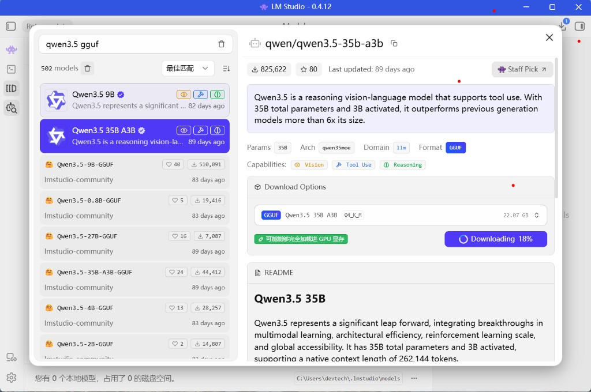

<!--
Copyright Advanced Micro Devices, Inc.

SPDX-License-Identifier: MIT
-->

### 在 LM Studio 上下载 Qwen3.5-35B-A3B

要下载 Qwen3.5-35B-A3B 模型：

1. 按键盘上的 `Ctrl + Shift + M`，或者点击左侧边栏上的 `Discover` 选项卡（放大镜图标）。
2. 搜索 `qwen/qwen3.5-35b-a3b`。
3. 选择 `Q4_K_M` 并点击 **Download**。

<p align="center">
  
</p>

LM Studio 会自动下载模型，并将其放置在正确的目录中。

如果你想下载其他模型，可以在 `Discover` 选项卡中搜索，LM Studio 会处理其余流程。

<!-- @os:windows -->
<!-- @test:id=lmstudio-model-present-qwen3-35b-a3b-windows timeout=60 hidden=True -->
```powershell
lms ls --llm | Select-String -Pattern "qwen3.5-35b-a3b"
```
<!-- @test:end -->
<!-- @os:end -->
